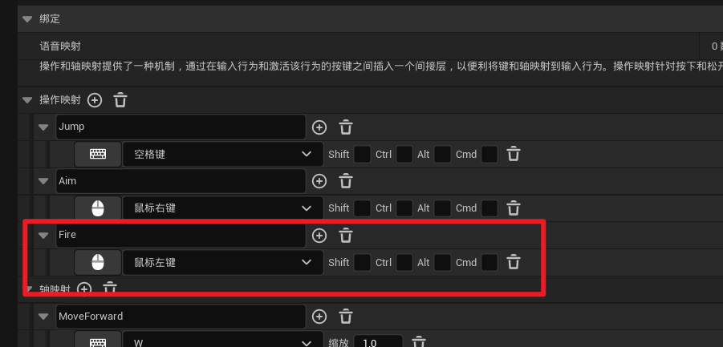
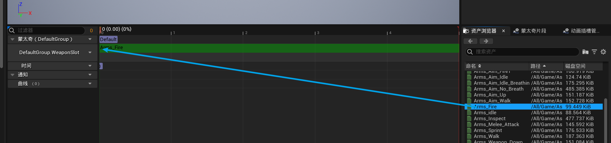
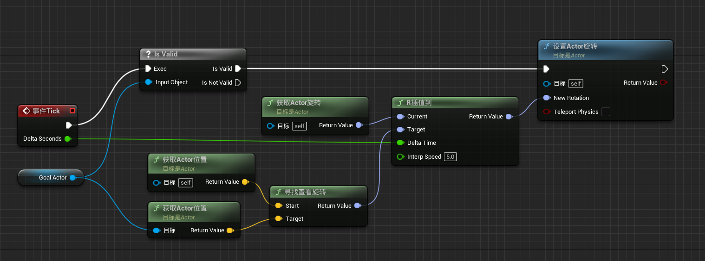
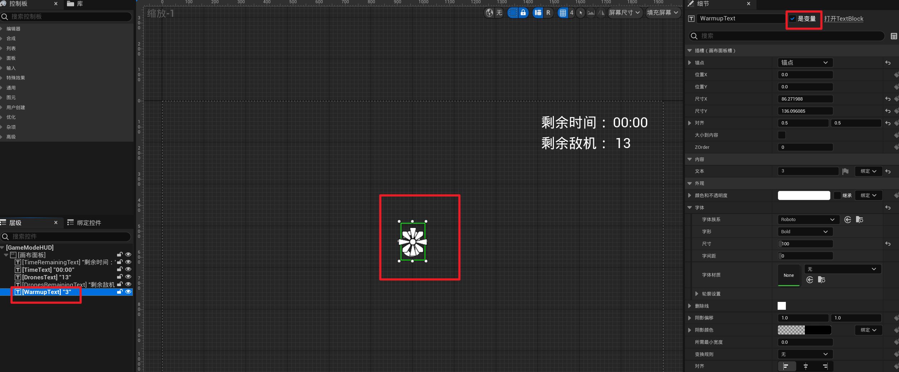
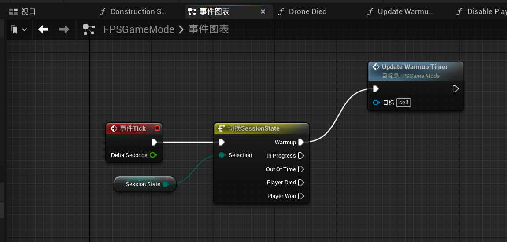
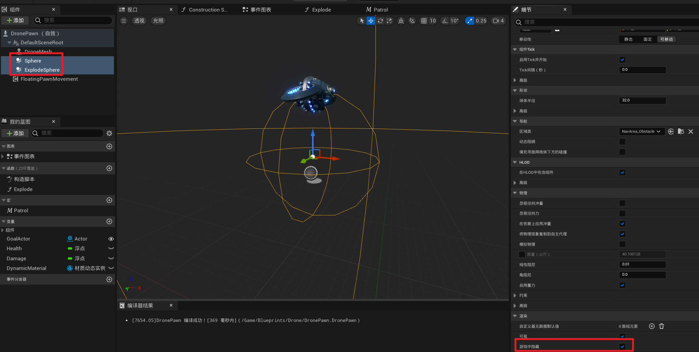

本教程将从头开始制作一个FPS游戏

使用到的Unreal版本是5.0.x

# 场景配置

## 导入素材

在虚幻市场中下载这个场景，并将之添加到初始项目里

将示例场景中的Demo_Scene复制到自己创建的Maps文件夹中，取名为FPS_Level

****

打开这个地图的关卡蓝图

把下面这一段都删掉

然后把这个电影序列也删掉

## 创建天空

首先把目前几个能发光的都删掉

添加天空大气和定向光源

再放一个天空盒进来

加点云进来

把天空盒链接上自己的定向光源

还可以调星星的亮度

如果此时你按ctrl+L，把太阳放下去，会发现整个场景一片漆黑，此时就说明需要加一个天光进来

把太阳放下去，让天空变暗，然后调大天光的强度范围

找到全局后期处理体积，把lens flares的强度取消，这样镜头前就不会出现光晕

取消自动曝光

复制一下外面的地面，把胡同口堵住，形成一堵墙

## 添加素材

再添加两个资源到项目里

整理一下文件结构

删掉多余资产

打开这个网格体

****

创建一个文件夹

移动文件夹

你会发现就算移过去，这个文件夹还是存在，这是由于重定向的一些问题，我们需要修复它

下面的ParagonLtBelica也是一样，这两个文件夹修复完之后就可以直接删掉了

这是最终的项目目录

# 人物塑造

创建如下目录，并创建一个角色蓝图

添加一个摄像机

选中网格体，并调整到合适的位置

编译保存之后，把这个角色蓝图拖到场景里，设置自动控制玩家

## 位置移动

打开项目设置，添加输入事件

在FPS_Character中编写如下蓝图

编译运行，你就可以用键盘控制玩家的移动了

## **控制视角**

## **跳跃**

可以自由控制跳跃的相关参数

## **动画**

创建文件夹，并新建一个动画蓝图，并命名为FPS_AnimBP

回到FPS_Character，点击网格体，使用我们自己的动画蓝图

**开始配置动画**

放一个状态机，添加一个变量

添加两个状态

从右下角的资产浏览器里取动画资产

Idle状态

Walking状态

Idle到Walking的规则

Walking到Idle的规则

# 武器

## 绑定手部模型

打开这个网格体

添加一个插槽

给这个插槽添加一把枪（图中已经加了

重命名成HandSocket

把枪移动到合适的位置

可以打开上面提到的Arms_idle来校准枪的位置

打开FPS_Character，创建一把枪

在Construction Scripts里将枪和手关联起来

## 瞄准

打开FPS_AnimBP，创建一个变量

添加操作映射

打开FPS_Character的事件图表，创建如下蓝图

配置瞄准动画

上面配置了Idle和Walking的状态，这里需要改一下，把Idle和Walking的状态剪切一下，等会用。先创建这两个状态

在Aim状态中创建一个状态机

把Idle和Walking的状态粘贴过来，并改名

改一下对应的序列播放器

Not Aiming也是一样

Not Aiming的序列播放器不用改

这样就做好了瞄准和没瞄准的动画了

如果你觉得运行起来的时候，瞄准状态里的枪的位置有点高，可以这样调整一下

调完了别忘了改回自己的动画蓝图

## 弹出弹壳

加一个开火控制

创建一个场景组件，命名为Burst Point

摆正位置（注意绿标的朝向

如果发现枪口一直在动，可以暂停动画，注意调整完了之后要继续打开动画

然后在事件图表中写这么一段蓝图，注意Emitter Template的引用 

如果你发现每次点击，都会发射三发子弹，可以通过如下方式来调整

打开P_BelicaMuzzle

删除到只剩一个

前面几个也是类似

加一个音效

## 开火动画

开火的时候给手臂加点动画

命名为FireMontage

打开这个

创建一个新插槽

选择新插槽

拖过来

改一下混入混出时间

在FPS_AnimBP中加入这个蒙太奇

然后在FPS_Character中播放蒙太奇

保存运行，就可以看到开枪的时候有手部抖动的效果

再创建一个新的蒙太奇，叫AimFireMontage

修改FPS_Character

## 整理代码

整理一下FPS_Character的代码，将之整合为三个函数

## 击中效果

本质是在射击的同时发出一条追踪线，检测击中的位置，然后播放一个击中的效果即可

# 敌人

创建一个Pawn类，命名为DronePawn

创建一个骨骼网格体，把对应的资产放进去

在细节窗口继续往下滑，修改碰撞预设

## 击中效果

首先配置击中时的音效，先导入初学者内容包

创建音效衰减，命名为Drone_att

打开这个

****

这样的话就混合了两个音效，有回声，比较像真实的爆炸效果

接着导入一个新的资产，使用里面的爆炸效果

给DronePawn创建一个Explode函数

注意粒子系统，别用错了

然后在FPS_Character中补充对应的逻辑

可以把这个Actor拖到场景里，体验一下效果

## 自动寻路

给Drone添加一个Sphere碰撞体，如果玩家进入这个Sphere，就自动锁定玩家，并朝玩家所在位置飞过去

创建Sphere并调整大小，可以搞大点

设置在游戏里可见（这里是方便调试，正式导出的时候可以关掉）

添加导航组件，放到路面上，按p建，会发现与地面重合的部分变绿了，绿的部分就说明可以导航

然后把这个导航网格疯狂放大，直到能覆盖所有的路面

如果发现有路沿没办法被覆盖，可以调整一下项目设置

调整好之后再按一下P键就可以让绿色消失了

接下来给Drone创建一个移动组件

补充蓝图

就可以实现追踪的效果了

再创建一个小一点的ExplodeSphere

当玩家与ExplodeSphere碰撞的时候，就发生爆炸

但是有个问题，当你绕到背后的时候，会发现Drone是背对着你飞过来的，这明显不对，我们还需要调整一下

首先摆正网格体的位置，让正面朝向绿色的标

然后补充如下蓝图

## 巡逻

创建一个Actor，命名为PatrolPoint，也叫巡逻点，主要用于定位，不用写什么功能

为了确认在游戏中的位置，可以加一些调试代码

在场景里加上两个巡逻点

然后互相指定为对方的NextPoint

然后修改DronePawn的变量，并添加如下代码

并在场景中指定DronePawn的GoalActor为某一个巡逻点

这些个操作的主要原理是：设定GoalActor为初始巡逻点，然后敌机就会在游戏启动的时候移动过去，移动到巡逻点之后，会将GoalActor设置为下一个巡逻点，然后继续移动，如此往复。当玩家进入敌机范围时，又会将GoalActor设置为玩家，然后循环就打断了，敌机开始向玩家移动

## 碰撞优化

这里我们有蛮多碰撞的检测体，如果敌机的数量变多，那碰撞的次数也会变多，会无端的消耗性能，所以我们可以做一些优化

# 用户界面

创建一个控件蓝图，命名为CharacterHUD

## 准心

注意，，锚点需要配置在中央

此时运行游戏，就能发现中间有个准心了

然后发现瞄准状态的时，准心和枪的位置不在一起，需要调整

在这个状态下调整抢的位置，能够实时反映到游戏窗口，调整好之后切换回去就可以了

## 敌机血条

目前我们是一下就能把敌机打爆，现在需要设置敌机血条和我们的伤害值，要多打几下才能打爆

这一堆代码不好看，可以把后面关于巡逻的代码折叠成一个宏

## 玩家血条

在Character中添加一个进度条

修改敌机代码

修改FPS_Character

因为一个函数的代码量有点多，所以这里折叠了蛮多代码，细节如下

# 小优化

## 子弹连发

把FPS_Character中的这些代码都折叠成函数FireWeapon

FireWeapon也要改一下

## 弹药限制

限制子弹数量，不能无限多

**注意这里两个文本的锚点都需要设在右下方，不然显示不出来的，还有两个文本变量的命名，后面要用到**

在开始运行时，设置弹药数量

在开火时检测弹药数量，开火完后减去弹药数量

## 补充弹药

创建一个Actor蓝图，命名为AmmoPickup

在FPS_Character中创建一个函数

在AmmoPickup中调用

然后将这个Actor放入场景就可以了

加一点旋转动画

## 激怒敌机

修改DronePawn代码，新增一个自定义事件

然后在FPS_Character中应用一下

这里还希望，当敌机被激怒的时候会变红，实现过程如下：

给敌机创建一个材质实例

可以看到这里用于控制颜色的字段是TeamColor

我们需要在游戏运行的时候给他创建动态的材质实例

打开DronePawn的构造脚本，编写如下蓝图

然后在事件图表中稍作修改即可

## 治疗

创建一个Actor，命名为HealthPickup

在FPS_Character中创建一个函数

在HealthPickup中调用

加一点旋转动画

# 游戏模式

创建FPSGameMode

## 剩余敌机

创建一个新的控件蓝图GameModeHUD，四个文本的锚点都在右上方，DronesText 和 TimeText 都要提升为变量

编写FPSGameMode蓝图代码

创建一个击败敌机的函数

在敌机爆炸的时候调用

## 热身时间

在游戏开始之前，有3秒钟的倒计时，此时玩家不能打也不能动，3秒之后再开始

由此我们需要管理一下游戏状态，创建如下枚举，命名为SessionState

枚举内容如下

修改GameModeHUD

打开FPSGameMode，按顺序编写蓝图

优化一下FPSGameMode的事件开始运行时

## 游戏倒计时

给GameModeHUD加上文本组件

按照顺序编写FPSGameMode蓝图

如果倒计时在10秒内就变红

## 游戏输赢

玩家赢了

玩家被打死了

## 收尾

