# 环境配置

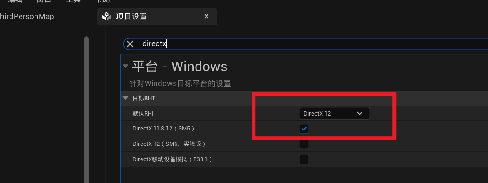

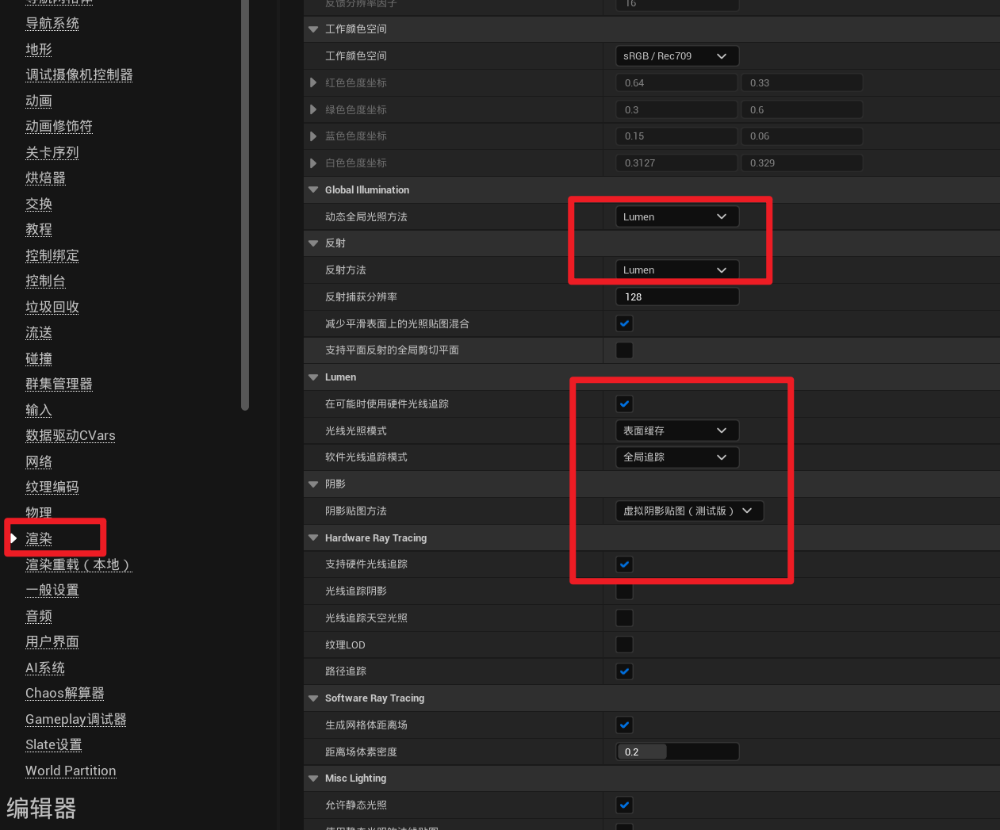

# 阴影

对于任何一个光源来说，都有光强，颜色等通用参数，这里就不在详细讲述，只是说一些比较特殊且有用的属性

## 点光源

源半径是指点光源的大小，你可以把点光源理解成一个电灯泡，源半径就是这个灯泡的大小。源半径越大，它照射到的物体的阴影就会更加柔和；源半径越小，阴影就会越硬。这里可以去了解一下本影和半影的概念

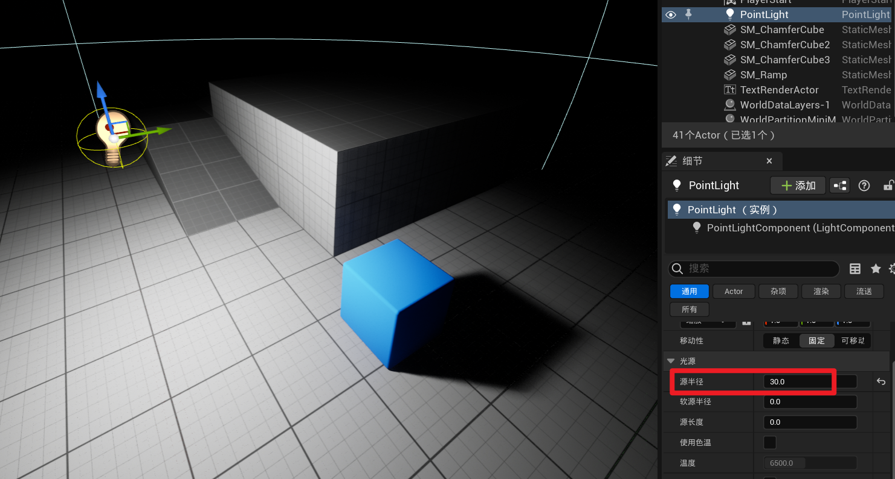

### 定向光源

源角度，相当于点光源的源半径；源角度越大，阴影越柔和

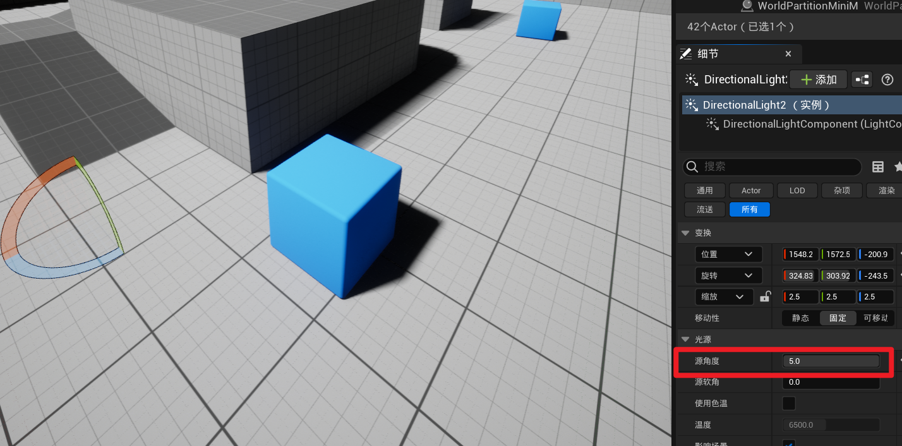

## 阴影贴图

我们平时在用阴影贴图的时候，仔细观察，会发现就算是软阴影，也会有一条硬边

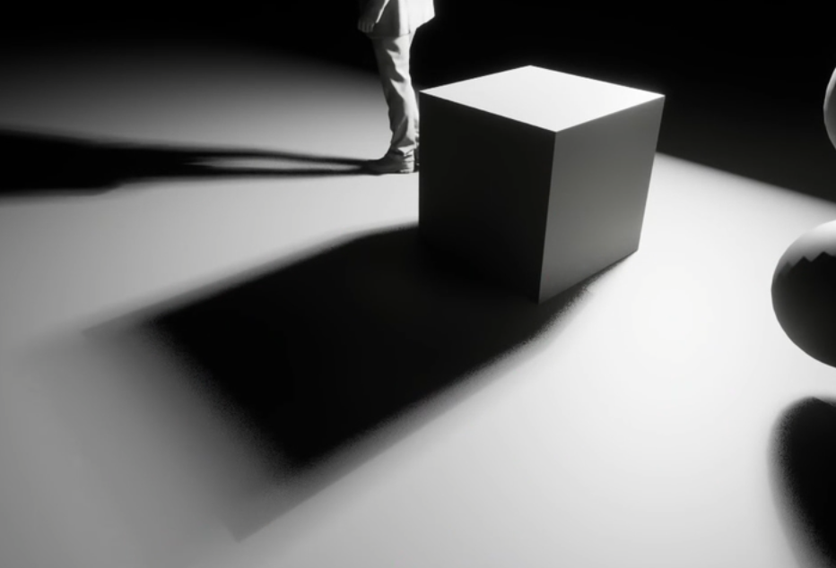

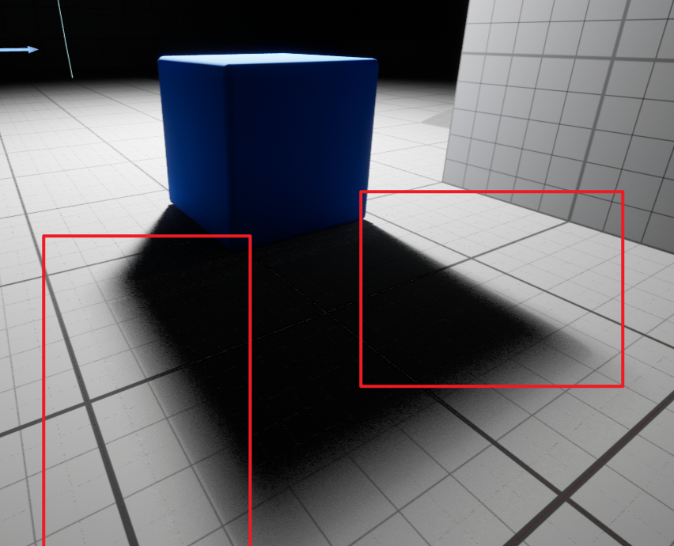

这个时候如果我们开启光线追踪，效果就会马上不一样了

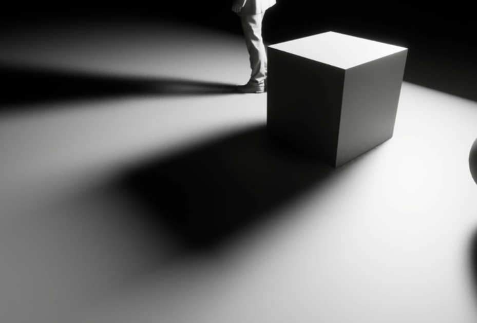

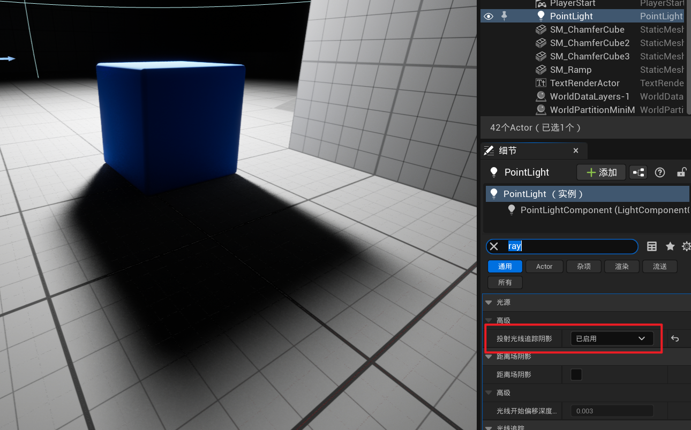

再对比一下，阴影贴图和光线追踪的区别

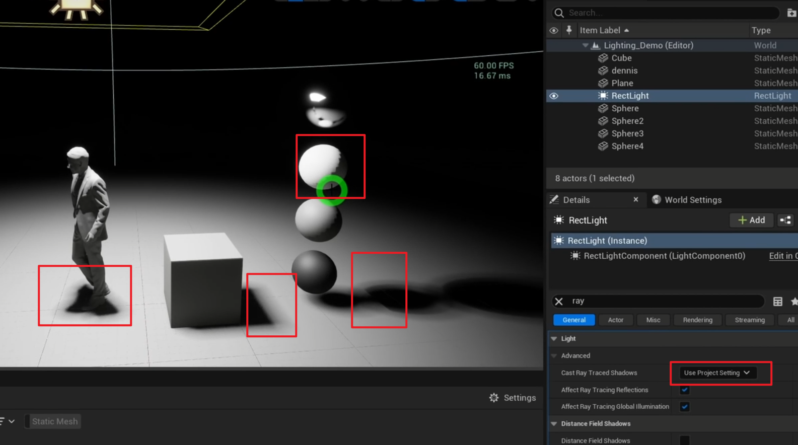

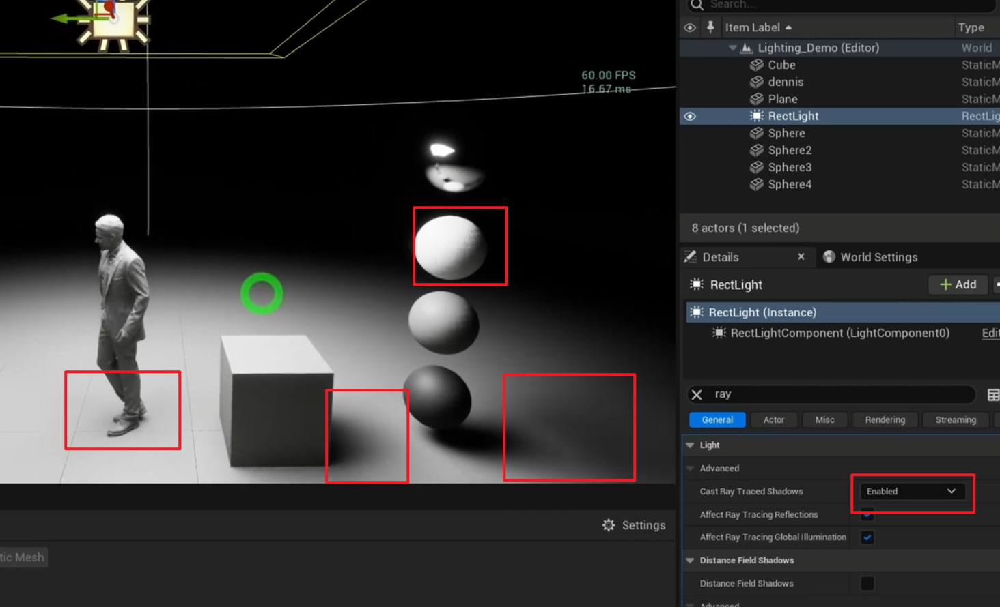

## 曝光基准表

大自然中没有曝光率为0或者1的材质

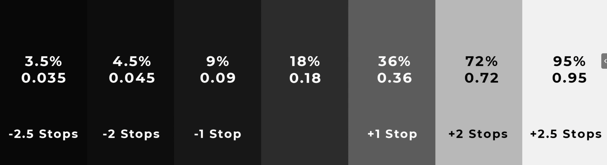

## 间接光照

用于提升光的反射

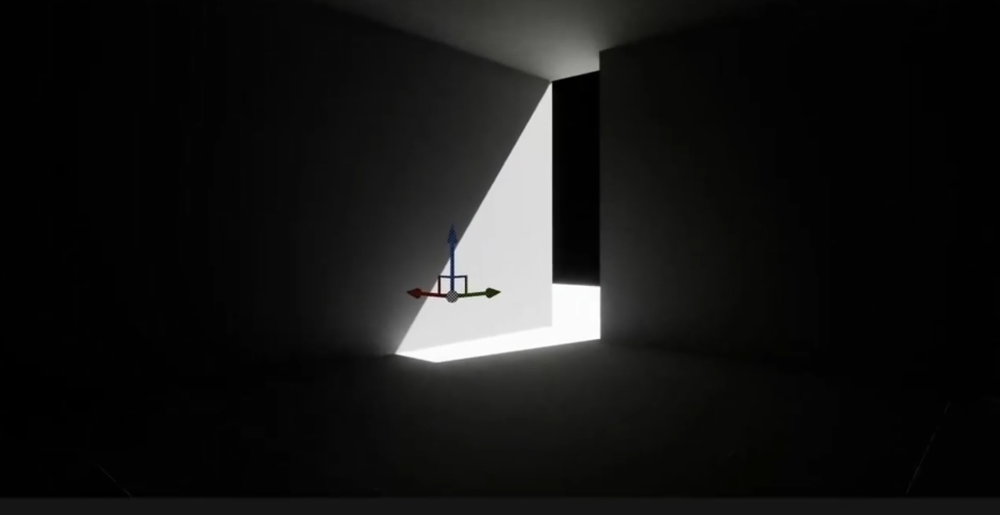

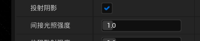

如果在封闭环境下，提高了间接光照还是不够亮，那么就可以提升墙体材质的基色值，这同样会增加反光，从而提高间接光照（注意，前提是间接光照的强度不能太小）

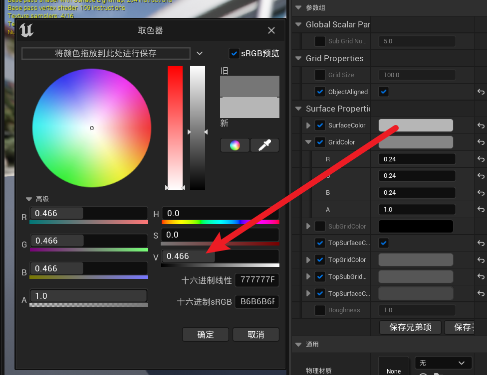

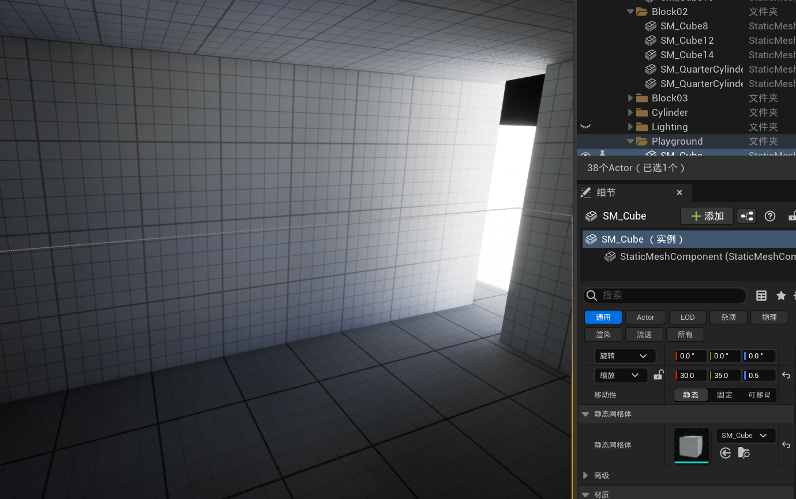

如果要减少环境的曝光量，那么反着来就行了

## 环境光照混合器

可以快速帮你创建一个初始的环境光

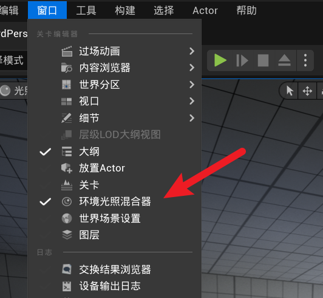

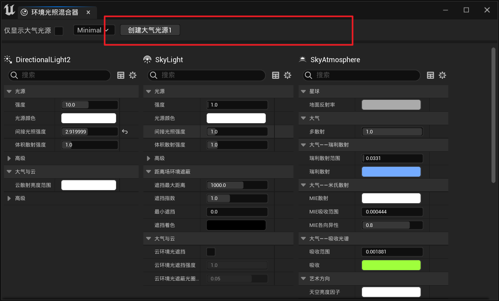

## 后期处理体积

让整个场景都生效

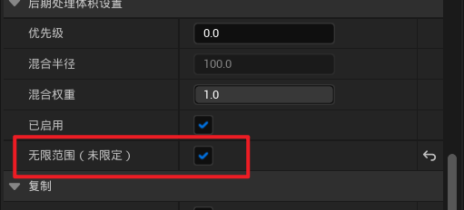

关闭自动曝光

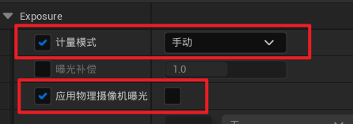

调整环境光照（增加相机曝光）

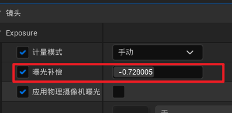

如果你发现间接光照导致环境中某些地方有些闪烁，可以考虑提高**Lumen场景光照质量**和最终采集质量，并降低**最终采集光照更新速度**，或许会让这种现象变得不那么明显

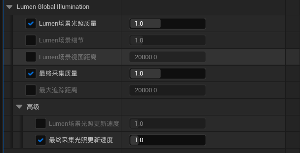

## 雾

雾可以产生丁达尔效应或者神光

首选选中指数级高度雾，打开体积雾

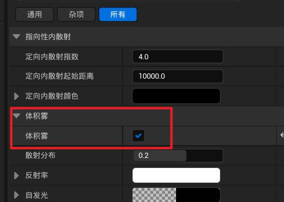

然后提高定向光源的体积散射强度

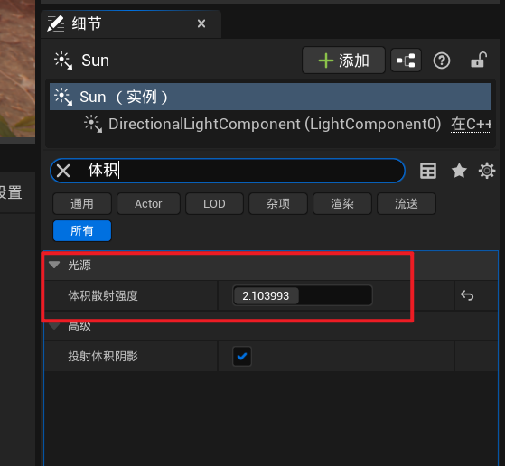

就可以搞出这么个效果

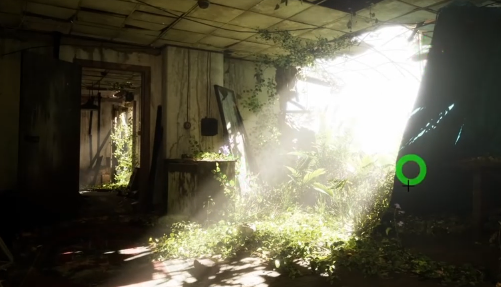

体积雾下面的散射分布可以让神光的效果变得不太一样（如果提高散射分布，那么从旁边看，就没有神光，但是在神光照射处抬头看，就会十分梦幻）