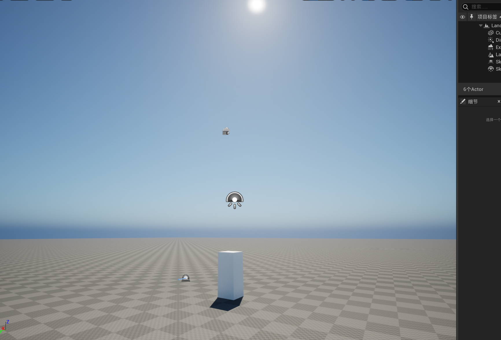
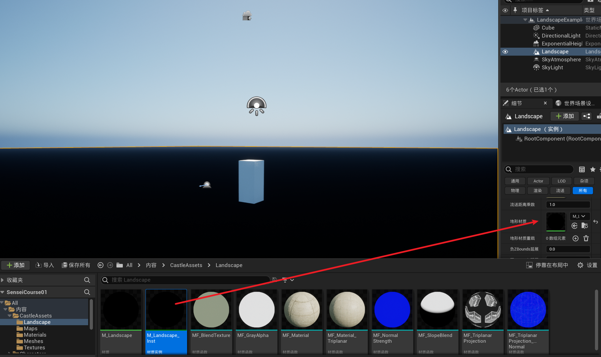
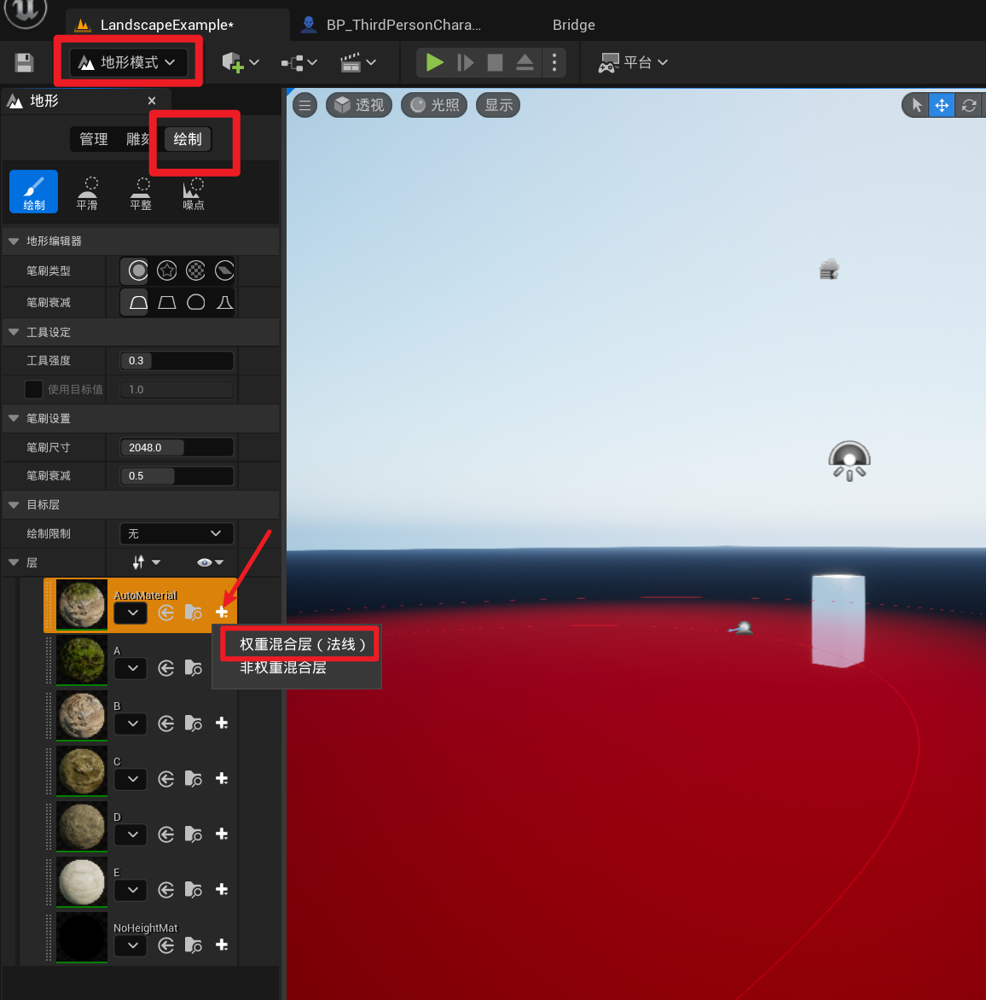
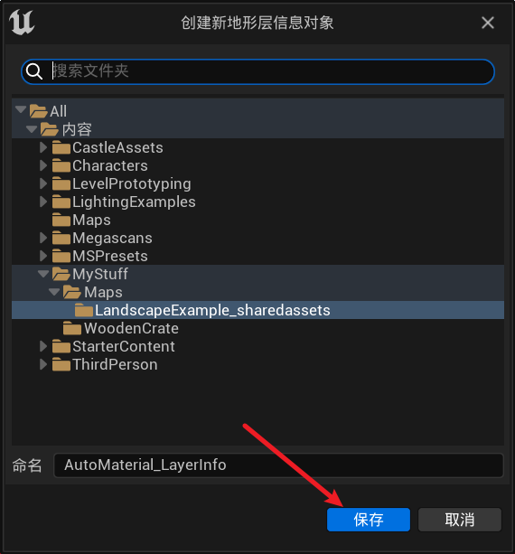
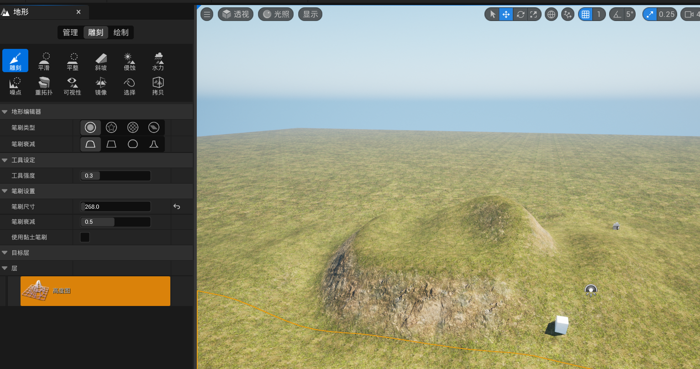
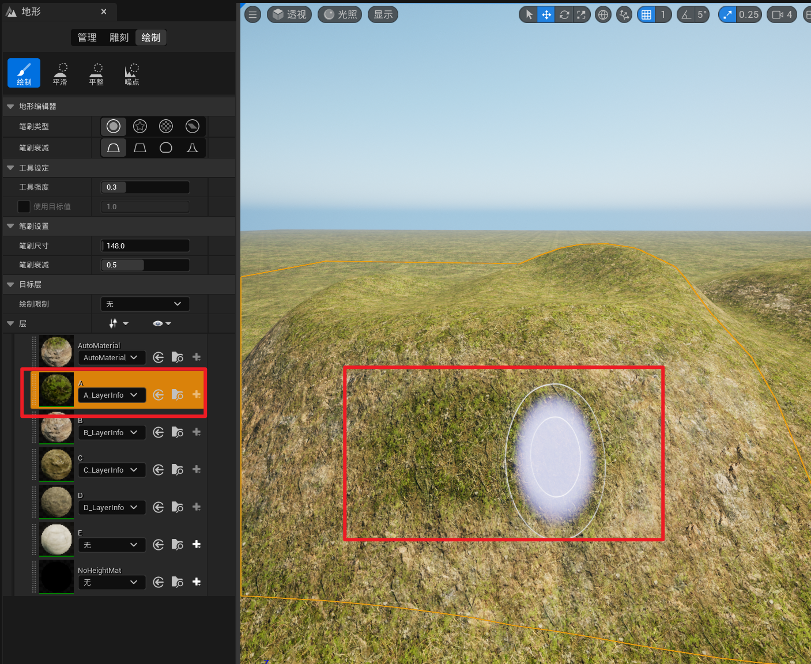
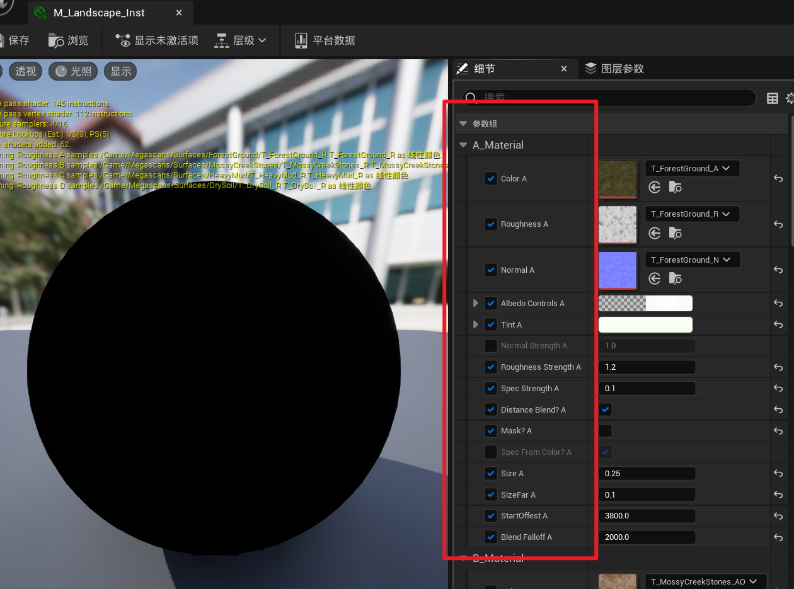

在这里我们将搭建一个完整的场景，首先导入素材

创建一个初始场景

接着把地形材质实例应用到地面上

你会发现整个地面都是黑的，不要紧，我们需要给他配置权重混合层

把上图中的A、B、C、D都创建上权重混合层

然后开始雕刻地形，拢出一定的高度出来

会发现随着高度的变化，地形的材质也会有所变化，这是材质所造成的的

如果想调整材质，比如说让峭壁上覆盖一层草，可以在绘制中，选择对应的图层进行绘制

对于地形材质，也可以通过调整材质实例上的一些参数来达到不同的效果，比如添加距离场，蒙版或者粗糙度等等

