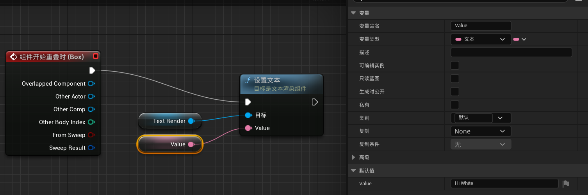
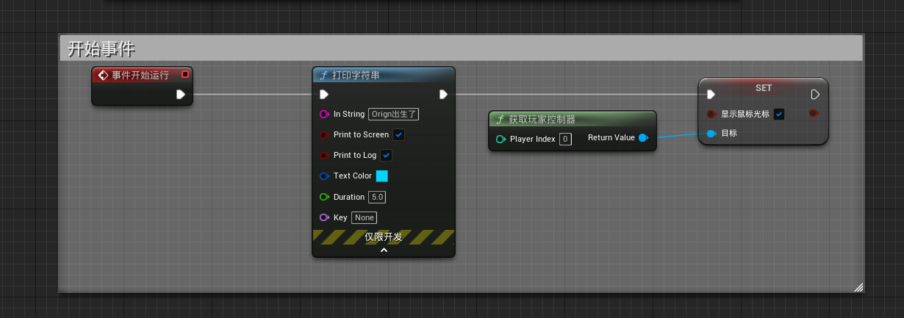
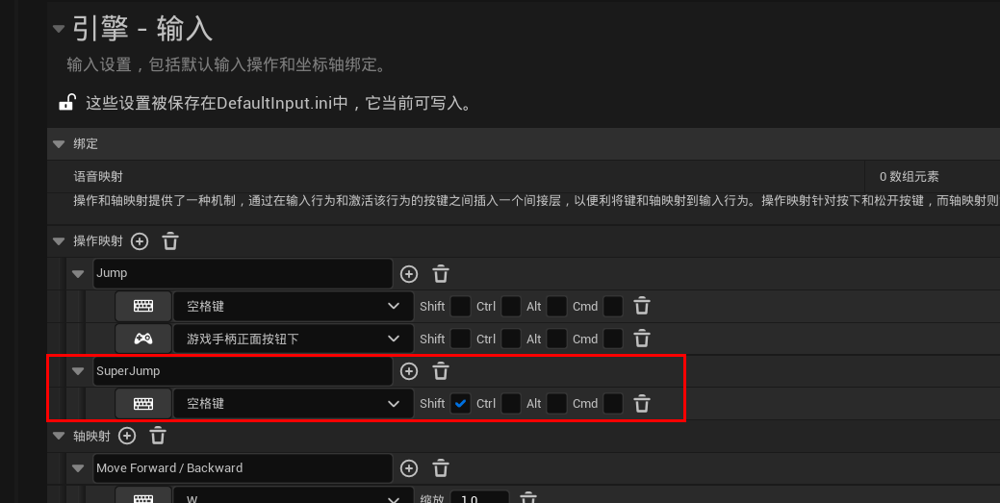
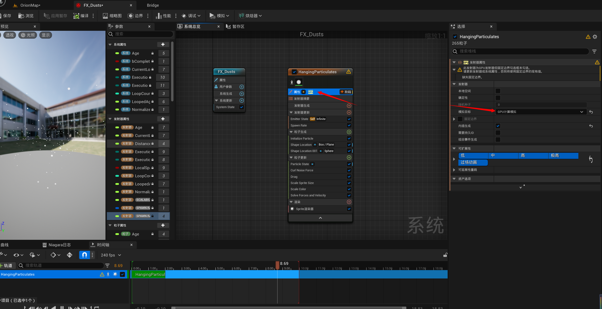
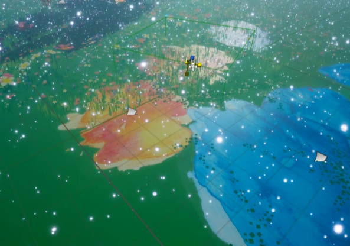

# 操作规范

目录结构使用说明

# 系统设置

## **修改默认地图**

## 给模型添加碰撞

选中模型之后按ctrl+e进入蓝图编辑

点击碰撞，选自动凸包碰撞

根据想要的精度选择对应的数值即可

# 角色控制

## 操作映射

## 放置角色

将角色蓝图放置在场景中之后，选中角色，在细节栏中找到自动控制玩家，将其改成玩家0即可

## 控制摄像机

选中角色，按Ctrl+E进入蓝图编辑界面，修改cameraBoom的插槽偏移即可

## 角色移动

选中角色，按Ctrl+E进入蓝图编辑界面，点击角色移动，修改细节栏即可

## 显示鼠标光标

修改人物蓝图，添加如下事件

## 滚轮控制摄像机

通过鼠标滚轮来控制摄像机的远近，同时限制最大和最小的距离

目标臂长度的变量名叫做TargetArmLength，目前没有中文翻译

# 蓝图

蓝图主要包含**视口**和**事件图表**两部分

在视口中可以添加一些组件，比如文本或者盒体碰撞器等等，然后在视口空间内编辑这些组件

点击组件后可以右键选择添加事件，或者直接在右边的细节栏中选择添加

添加完相应的组件后，可以在事件图表中找到它，并添加一些操作

## 文字变化

下面是一个简易的蓝图，当人物进入指定空间内时，空间内的文字会发生变化

视口如下

事件图表如下

## 触发火焰

首先在视口空间里添加3个组件：球体（sphere）、粒子系统组件、盒体碰撞器（Box collision）

给球体添加一个木头的材质，然后在粒子系统的模板中选用火焰模板，并将火焰调整到合适的位置，大致效果如下

调整完毕之后将粒子系统的可视关掉

选中Box collision，添加相应事件，具体如下

把这个蓝图拖到场景中，运行起来就可以看到效果了

## 添加注释

在蓝图中左键框选对应的代码，然后按C，即可添加注释

## 输出存活时间

在角色的蓝图中添加Tick事件，该事件每帧都会被调用

添加一个LifeSeconds浮点类型的变量，编写下图所示的蓝图

运行效果

## 超级跳(带冷却)

添加一个SuperJump的操作映射

蓝图如下

## 点击事件(时间线)

**实现效果：鼠标点击后，操纵杆自动开或者关**

在人物蓝图中启用鼠标点击事件（EnableClickEvent）和屏幕触控事件(EnableTouchEvent)

创建一个蓝图，添加操纵杆模型

创建一个时间轴，添加浮点型轨道

将轨道名改成alpha，在轨道中添加两个关键帧，分别是（0,0）和（0.5,1），并选中使用最后一个关键帧

右键操纵杆，添加鼠标点击事件

其他蓝图的实现如下

Flip Flop的实现效果是，第一次点击会走A，第二次点击会走B，如此反复

时间轴中的Play from Start是将时间轴正向运行，Reverse from End是反向运行

插值的作用是让运动更平滑

# 视觉效果

## 指数级高度雾

给整个场景添加一层雾气

可通过雾密度和雾高度衰减来调整雾的浓度

通过雾内散射颜色来调整雾的颜色

体积雾可以让光发生一定的反射折射效果，让雾更真实

如果此时给定向光源加上光束遮挡的效果，就可以实现体积光（丁达尔效应）

## 后期处理体积

可以指定某一范围内的后期处理，也可以选择全场处理

Bloom是用来调整光强的

Exposure是用来调整曝光的

Chromatic Aberration产生色差畸变现象

Dirt Mask在镜头前添加一层蒙版

Image Effects修改边角明暗

可以在**颜色分级**中调整色彩饱和度、对比度等数值，可以对全局、阴影、中间调、高光等等部分进行分别操作

## 粒子特效

### 灰尘

创建一个FXs文件夹，在里面创建Niagara系统

将发射器属性改成GPU

修改粒子数量

将这个粒子系统文件拖入场景中（）

修改粒子的范围，将整个系统扩大

让粒子发光，只需要让rgb的值大于1就可以了

# 声音

## 空间化

通过空间化和衰减，可以让玩家在声源范围内听到声音，并有一定的衰减过程。超出范围则没有声音

# 材质

## 延迟贴花

将材质域设为延迟贴花，然后混合模式设为半透明，如果贴图有白色背景的话，可以将A连接到不透明度

然后就可以将这个贴花附着在地面上了

## 取消接受贴花

有时候贴花会染到模型上面，可以选择取消接受贴花

如果是人物的话，点进蓝图，然后选择网格体，选择取消贴花即可

## 制作法线贴图

使用PS即可自动制作法线贴图

