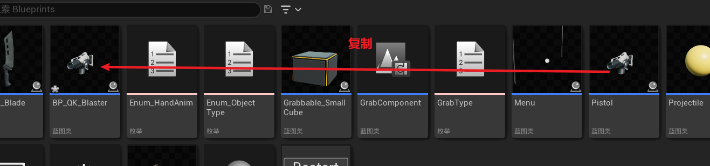
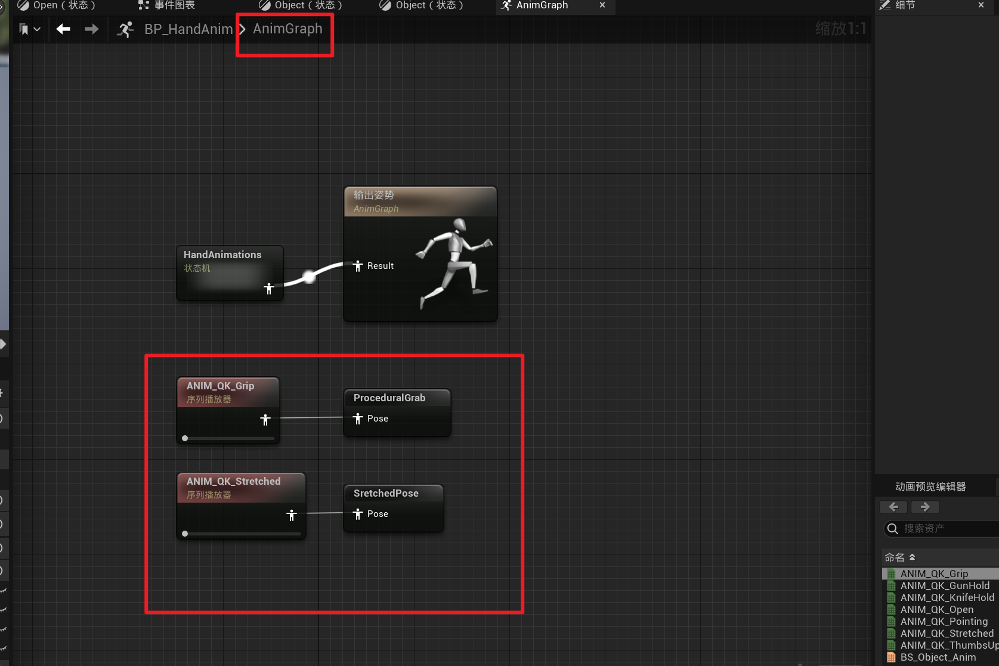

# 手部模型

## 导入模型

先创建一个Assets文件夹，导入手部模型

再创建一个Animations文件夹，导入动画

注意这里的导入选项

## 添加材质

创建一个材质M_QK_Hand，导入的三个贴图放到材质里，并按照如下排布

把这个材质应用到手上

## 更换模型

添加两个操作映射

接下来开始调试手部模型，打开VRPawn

选中MotionControllerLeft和Right，添加骨骼网格体组件，并对其命名

分别对左右网格体进行如下设置

关闭HMD的可视

禁止MotionControllerLeft和Right显示设备模型

然后编译保存，你将会发现你的控制器变成了手部模型，效果如下

## 手部动画

接下来开始创建动画，创建动画蓝图，并命名为BP_HandAnim

创建一个枚举，命名为Enum_HandAnim

再创建一个枚举，命名为Enum_ObjectType

双击进入BP_HandAnim，创建两个变量，注意命名和变量类型

配置状态和状态转换规则

依次双击每个状态机，配置相应资产，以下以Open为例

配置每个状态之间的过渡规则，这里以Open到Grip的状态过渡规则为例，双击那个双箭头的小图标，然后添加如下规则

接下来双击VRPawn，设置左右手的动画类

给VRPawn设置一些蓝图（注意变量提升之后要重命名和更改类别为HandAnimations，是类别不是变量类型）

创建下面6个布尔变量

添加如下蓝图

最后打开BP_HandAnim，我们来写一些状态转换的蓝图控制代码

先转换类型，创建序列

下面是控制动画的蓝图，看起来复杂，但实际还挺容易理解的，注意状态转换的细节和左右手，别弄错了

然后编译保存运行，你就发现你的手已经有了动画，并且能够抓取物体了

# 使用武器

## 导入模型

创建文件夹并导入武器文件，导入砍刀

导入手枪

导入之后你会看到这些文件，按照不同的颜色设置贴图，这里以蓝色为例

在设置好上面这些纹理贴图之后，你的枪应该看起来很正常

## 添加碰撞

开始给枪设置碰撞体

然后给每一个部件设置碰撞体，这里以手柄为例（每次都是右键Root_Bone创建）

移动位置成这样

然后开始给左边的每一个部件设置碰撞体，最终得到这样的效果

新增GrabType枚举

## 设置插槽

打开手部骨骼模型，为拿枪的动作添加一个插槽

把枪放进来

把枪移动到合适的位置

然后把这个资产移除掉

然后再创建一个近战插槽，选择握刀的动画，再把刀放进来

调整姿势如下

然后把资产移除，并把动画换成默认

## 使用插槽

打开GrabComponent，编写如下蓝图

注意，上面的每一次SET都是一次变量提升，记得修改它的变量名，跟上图保持一致。这些蓝图的意义是让我们在每一次Grab的时候能够调用对这些变量的引用

然后创建一个宏，方便获取插槽的位置和旋转，注意命名要保持一致

接下来编辑TryGrab函数，将红色框的蓝图复制两份到蓝色框的位置，并分别连接Pistol和Melee

编写如下蓝图，它对应Pistol这一块（注意SocketName，一定要和前面的插槽名字保持一致。观察蓝图，其实很多地方都是一样的，多用复制粘贴）

编写如下蓝图，它对应Melee这一块

然后编辑TryRelease函数

创建砍刀资产

把这把刀放进场景里

创建枪

把枪放进场景里

接下来你就可以运行测试了，你会发现你能够抓住这两个武器，并且有相应的物理碰撞和子弹发射

## 插入动画

还没完，我们还需要创建一个混合空间

命名为BS_Object_Anim，然后打开它

打开BP_HandAnim，进入Object状态，删掉原来的ANIM_OK_Grip序列播放器，编写如下蓝图

接着你可以再次运行查看效果，不出意外应该是一切正常（出意外了就好好检查一下过程吧，代码是不会骗人的，害）

# 手部物理效果

## 配置样条

首先打开VRPawn，把设备和右手的可视关掉

在左手上新建一个样条组件，并命名为L_ThumbArc

在这根样条线上右键，添加一个样条点

给三个样条点配置属性（注意关键帧）

然后复制粘贴这个样条组件，命名为L_MiddleArc，在L_MiddleArc上再加一个样条点，一共四个点，属性分别如下

然后继续复制粘贴L_MiddleArc，命名为L_IndexArc，四个样条组件的属性如下

继续复制粘贴L_RingArc，命名为L_RingArc，四个样条组件的属性如下

继续复制粘贴L_PinkyArc，命名为L_PinkyArc，四个样条组件的属性如下

然后把这五个样条组件拖到LeftHand下面

再分别配置他们的位置旋转和缩放

搞完之后是这么个效果

然后把样条复制到右手这边来，并改名

如果发现样条都乱了，就再把对应的位置旋转和缩放也复制过来

最后大概是这么个样子

## 配置抓取组件

接着创建两个变量

当用户拿起东西时，就设置对应的原始组件

放下时就设为空

## 追踪手指位置

创建一个结构，命名为Finger_Data

在VRPawn中添加如下变量，注意类别

其中FingerSteps的默认值为4

**创建一个函数GetFingerSteps**

在函数GetFingerSteps中创建两个局部变量

蓝图如下

## 检测手指碰撞

**创建函数Trace Finger Segement**

创建局部变量

蓝图如下（有点长，分两段截取）

## 整合所有手指

在VRPawn中创建一个新的图表，FingerAnimationGraph

创建自定义事件R_TraceFingerData 和 L_TraceFingerData

创建自定义事件Setup Finger Anim Data（截图不全，但都是重复性代码，可自行补全

## 追踪数据变化

在VRPawn运行之初调用

在GrabComponent的Try Grab中调用

## 调用动画

修改BP_HandAnim

