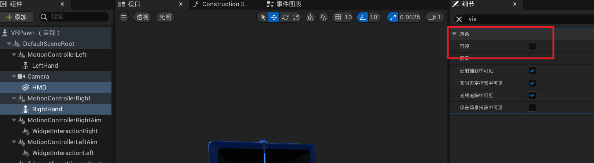
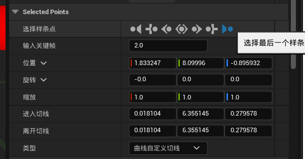
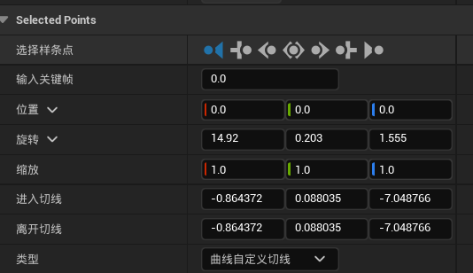
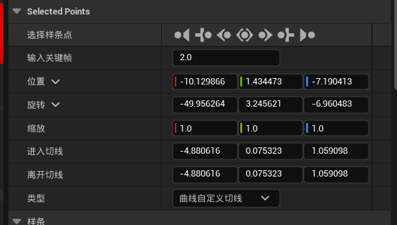
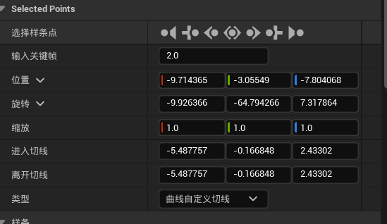
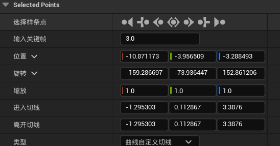

> 注：这部分还未完成，不具有参考意义，不用看！！！

# 手部物理效果

首先打开VRPawn，把设备和右手的可视关掉

在左手上新建一个样条组件，并命名为L_ThumbArc

在这根样条线上右键，添加一个样条点

给三个样条点配置属性（注意关键帧）

然后复制粘贴这个样条组件，命名为L_MiddleArc，在L_MiddleArc上再加一个样条点，一共四个点，属性分别如下

然后继续复制粘贴L_MiddleArc，命名为L_IndexArc，四个样条组件的属性如下

继续复制粘贴L_RingArc，命名为L_RingArc，四个样条组件的属性如下

继续复制粘贴L_PinkyArc，命名为L_PinkyArc，四个样条组件的属性如下

然后把这五个样条组件拖到LeftHand下面

再分别配置他们的位置旋转和缩放

搞完之后是这么个效果

