# 手部物理效果

首先打开VRPawn，把设备和右手的可视关掉

在左手上新建一个样条组件，并命名为L_ThumbArc

在这根样条线上右键，添加一个样条点

给三个样条点配置属性（注意关键帧）

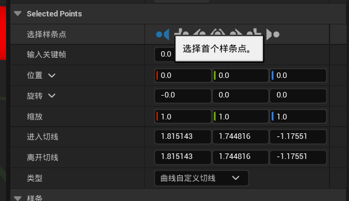

然后复制粘贴这个样条组件，命名为L_MiddleArc，在L_MiddleArc上再加一个样条点，一共四个点，属性分别如下

然后继续复制粘贴L_MiddleArc，命名为L_IndexArc，四个样条组件的属性如下

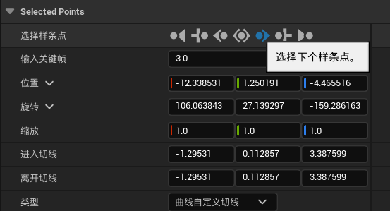

继续复制粘贴L_RingArc，命名为L_RingArc，四个样条组件的属性如下

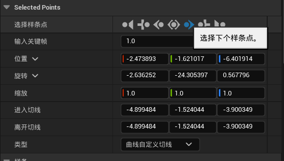

继续复制粘贴L_PinkyArc，命名为L_PinkyArc，四个样条组件的属性如下

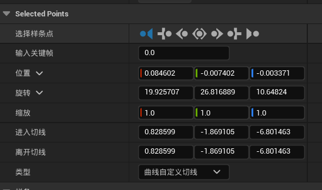

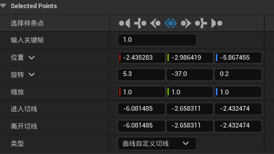

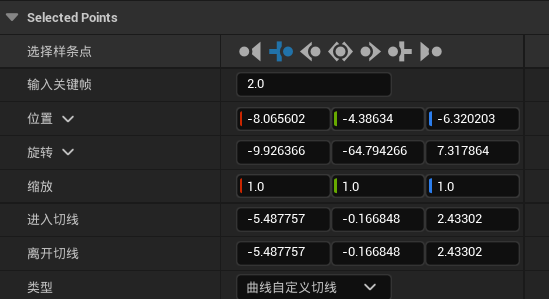

然后把这五个样条组件拖到LeftHand下面

再分别配置他们的位置旋转和缩放

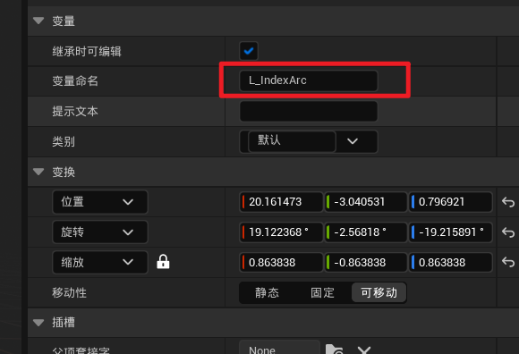

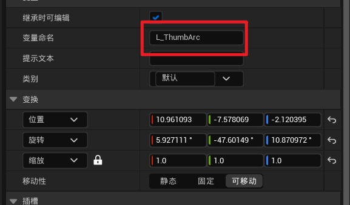

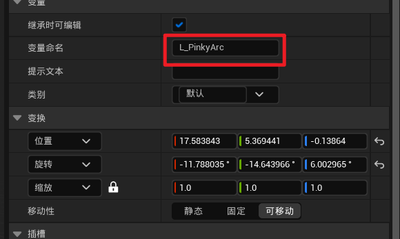

搞完之后是这么个效果

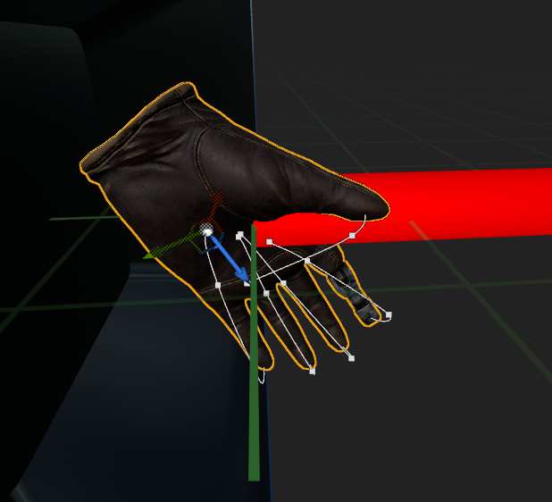

然后把样条复制到右手这边来，并改名

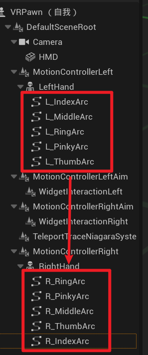

如果发现样条都乱了，就再把对应的位置旋转和缩放也复制过来

最后大概是这么个样子

接着创建两个变量

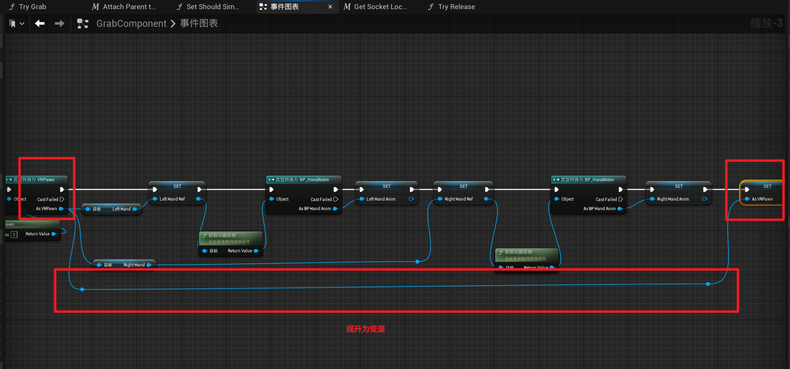

当用户拿起东西时，就设置对应的原始组件

放下时就设为空

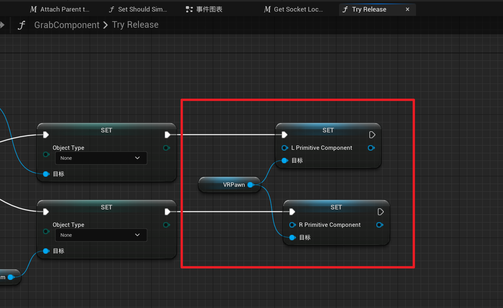

创建一个结构，命名为Finger_Data

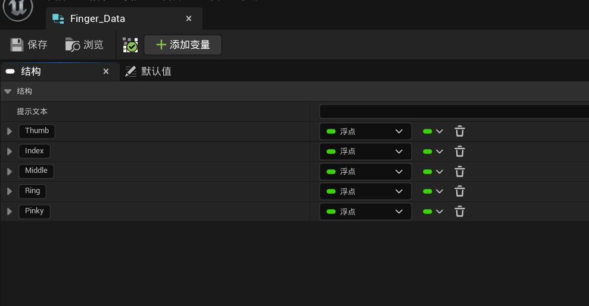

在VRPawn中添加如下变量，注意类别

其中FingerSteps的默认值为4

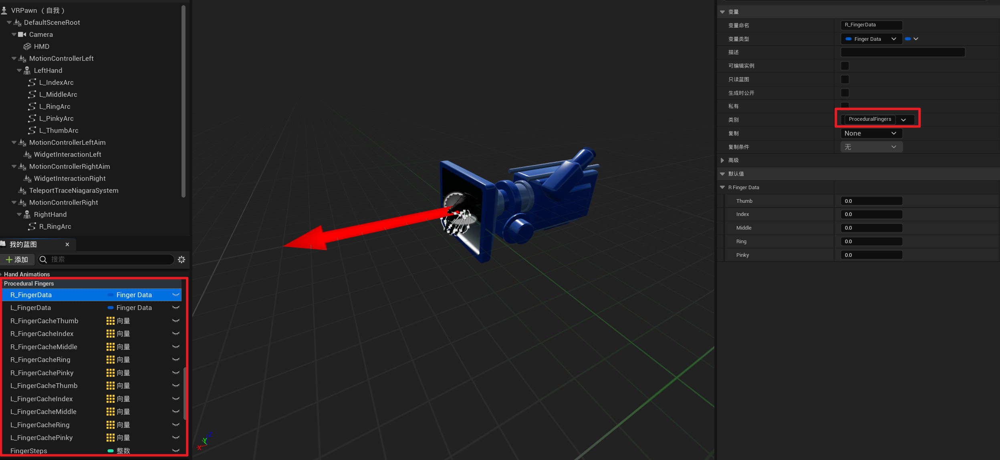

创建一个函数GetFingerSteps

在函数GetFingerSteps中创建两个局部变量

蓝图如下

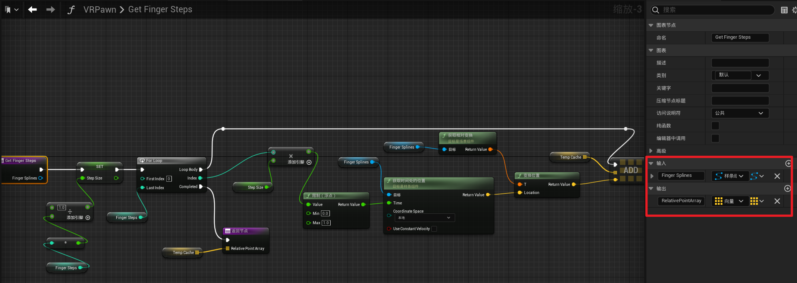

创建函数Trace Finger Segement

创建局部变量

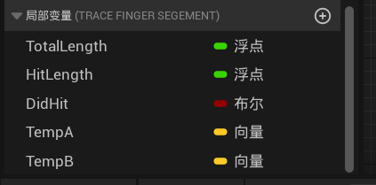

蓝图如下（有点长，分两段截取）

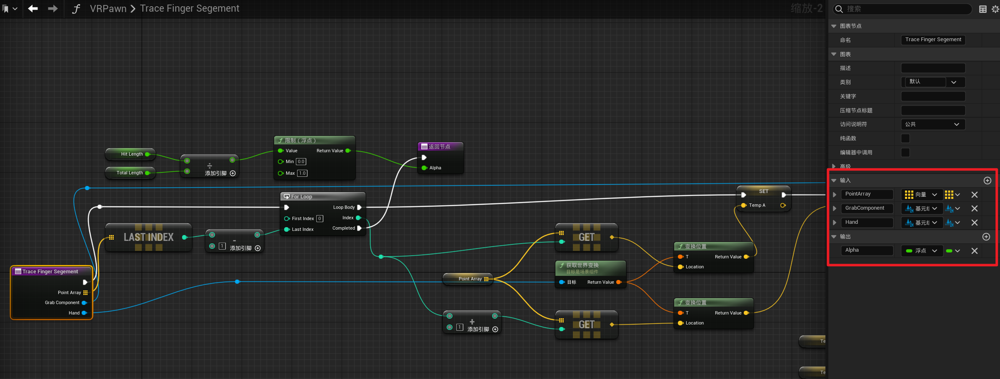

在VRPawn中创建一个新的图表，FingerAnimationGraph

创建自定义事件R_TraceFingerData 和 L_TraceFingerData

创建自定义事件Setup Finger Anim Data（截图不全，但都是重复性代码，可自行补全

在VRPawn运行之初调用

在GrabComponent的Try Grab中调用

****

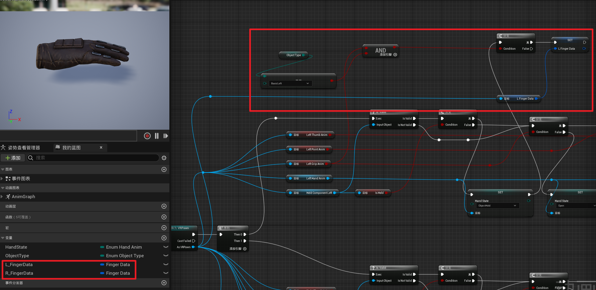

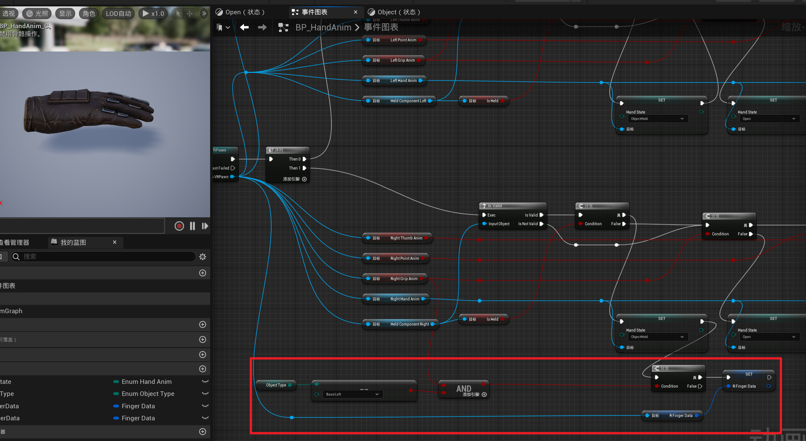

修改BP_HandAnim

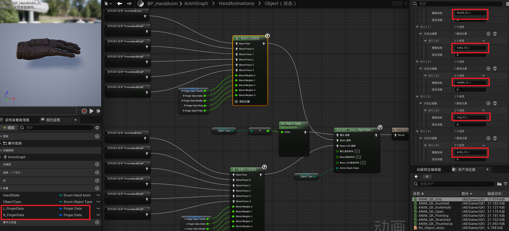
